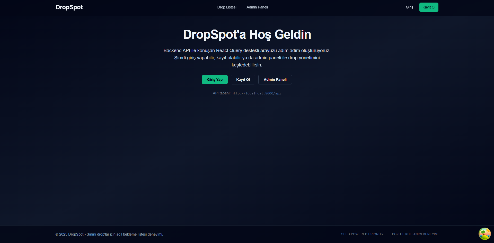
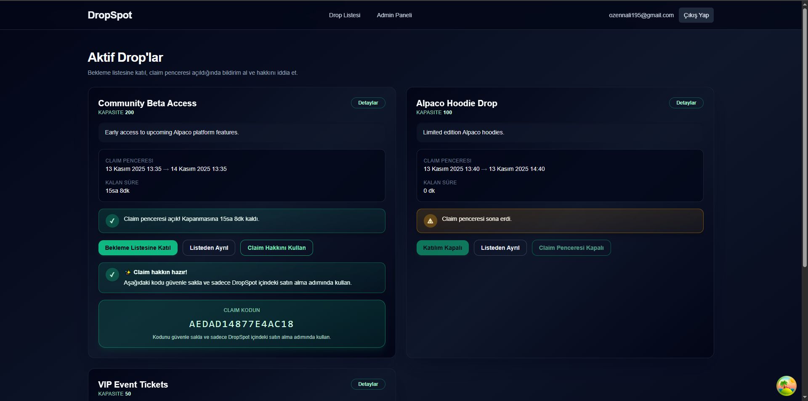
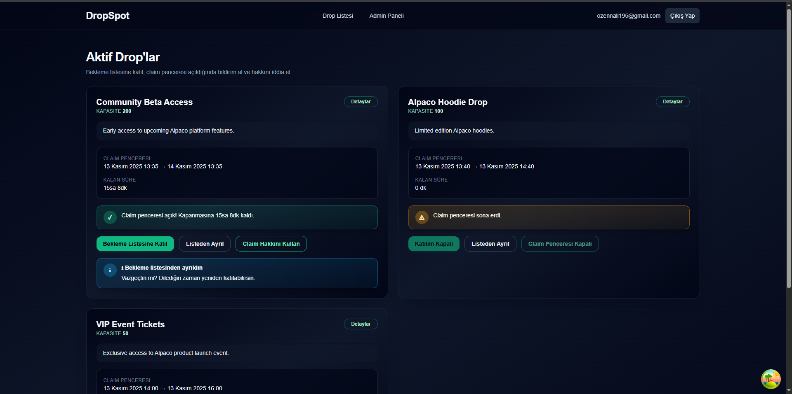
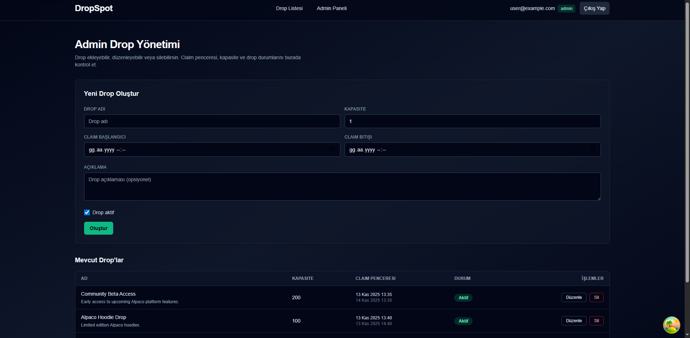
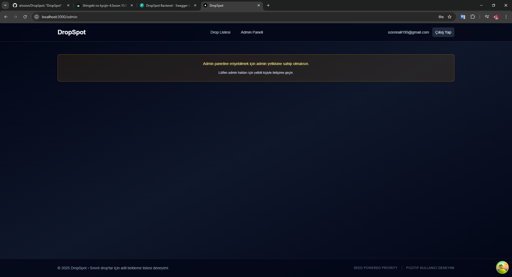

# DropSpot

> Project start time: **2025-11-13 13:10** (local)  
> Remote: `https://github.com/alioznn/DropSpot.git`  
> First commit epoch: `1763028013`  
> Project seed (sha256 prefix): **`5d75cfcdfd3f`**

---

## İçindekiler
1. [Proje Özeti](#proje-özeti)
2. [Mimari ve Teknolojiler](#mimari-ve-teknolojiler)
3. [Veri Modeli & API Uçları](#veri-modeli--api-uçları)
4. [Idempotency ve İşlem Güvenliği](#idempotency-ve-i̇şlem-güvenliği)
5. [Seed Tabanlı Öncelik Skoru](#seed-tabanlı-öncelik-skoru)
6. [Kurulum Adımları](#kurulum-adımları)
7. [Admin Yetkisi ve Test Kullanıcısı](#admin-yetkisi-ve-test-kullanıcısı)
8. [Test Komutları](#test-komutları)
9. [Ekran Görselleri](#ekran-görselleri)
10. [Bonus & Gelecek Çalışmalar](#bonus--gelecek-çalışmalar)

---

## Proje Özeti
DropSpot, sınırlı stoklu ürünleri adil şekilde dağıtmak için bekleme listesi ve claim penceresi kurgusu sağlayan uçtan uca bir platformdur. Çözüm hem backend (FastAPI) hem de frontend (Next.js) tarafında idempotent işlemler, seed tabanlı öncelik skoru ve kapsamlı testlerle desteklenmiştir.

---

## Mimari ve Teknolojiler
| Katman | Teknoloji | Önemli Paketler |
| --- | --- | --- |
| Backend | **FastAPI**, Python 3.11 | SQLAlchemy (async), Alembic, Pydantic, python-jose, passlib |
| Veritabanı | SQLite (dev) / PostgreSQL (destekleniyor) | asyncpg, sqlite+aiosqlite |
| Frontend | **Next.js 14**, TypeScript | React Query, axios, Tailwind CSS, react-hook-form |
| Test | Backend: Pytest | Frontend: Jest + Testing Library |

**Dizin Yapısı (özet):**
```
backend/
  app/
    api/        # FastAPI router'ları
    models/     # SQLAlchemy modelleri
    schemas/    # Pydantic şemaları
    services/   # İş kuralları (waitlist, claim, admin vb.)
    core/       # Config, security, priority helpers
  alembic/      # Migration betikleri
  scripts/      # Seed yardımcıları
frontend/
  src/
    app/        # Next.js app router sayfaları
    components/ # UI bileşenleri
    hooks/      # React Query hook'ları
    lib/        # API client & yardımcılar
```

---

## Veri Modeli & API Uçları
### Veri Modelleri
- **User**: `email`, `hashed_password`, `is_admin`, `is_active`, `created_at`.
- **Drop**: `name`, `description`, `capacity`, `claim_window_start/end`, `is_active`.
- **WaitlistEntry**: `user_id`, `drop_id`, `priority_score`, `joined_at`, `state`, `claim_code`.

### Temel API Uçları
| Method & Path | Açıklama |
| --- | --- |
| `POST /auth/signup` | Kayıt ol |
| `POST /auth/login` | Giriş yap (JWT döner) |
| `GET /drops` | Aktif drop listesini getir |
| `POST /drops/{id}/join` | Bekleme listesine katıl (idempotent) |
| `POST /drops/{id}/leave` | Bekleme listesinden ayrıl |
| `POST /drops/{id}/claim` | Claim penceresi açıkken hak talep et |
| `GET /admin/drops` | Admin drop listesi |
| `POST /admin/drops` | Yeni drop oluştur |
| `PUT /admin/drops/{id}` | Drop güncelle |
| `DELETE /admin/drops/{id}` | Drop sil |

Swagger UI: `http://localhost:8000/docs`

---

## Idempotency ve İşlem Güvenliği
- **Veri kısıtları:** `waitlist_entries` tablosunda `(user_id, drop_id)` benzersizdir. Aynı kullanıcı drop’a tekrar katılmaya çalıştığında, state güncellenir fakat yeni kayıt oluşmaz.
- **Transaction yönetimi:** Join/leave/claim flow’ları tek transaction içinde çalışır (`async SQLAlchemy session`). Hata anında rollback alınır.
- **Optimistic feedback:** UI tarafında kullanıcıya aksiyon sonucu açıklayıcı farklı mesajlar verilir (örneğin claim kodu üretildiğinde).
- **Waitlist -> claim geçişi:** Claim state’i `claimed` olarak güncellenir ve tek kullanımlık `claim_code` üretilir. Aynı claim kodu tekrar istenir ise aynı değer döner.

---

## Seed Tabanlı Öncelik Skoru
Seed değeri: `5d75cfcdfd3f`  
Katsayılar:
- `A = 7 + (0x5d % 5) = 10`
- `B = 13 + (0x75 % 7) = 18`
- `C = 3 + (0xcf % 3) = 3`

Öncelik formülü (özet):
```
priority_score = base
  + (signup_latency_ms % A)
  + (account_age_days % B)
  - (rapid_actions % C)
  + fractional(hash(user_id, joined_at))
```
- `base` değeri drop kapasitesi ve seed hash’inden türetilir.
- fractional bölüm 0–0.999 aralığında mikro farklılık sağlar.
- Skor bekleme listesine girişte hesaplanır ve claim sıralaması için kullanılır.

---

## Kurulum Adımları
### Ön Gereksinimler
- Python 3.11
- Node.js 18+
- Poetry (backend bağımlılık yönetimi)

### Backend
```bash
cd backend
poetry install
poetry run alembic upgrade head          # tablolar
poetry run python scripts/seed_drops.py  # örnek drop verisi (opsiyonel)
poetry run uvicorn app.main:app --reload
```

Varsayılan `.env` değerleri yoksa `DATABASE_URL` dev için `sqlite+aiosqlite:///./drop_spot.db` olarak kullanılır.

### Frontend
```bash
cd frontend
npm install
npm run dev
# http://localhost:3000
```

`.env.local` örneği:
```
NEXT_PUBLIC_API_BASE_URL=http://localhost:8000/api
```

---

## Admin Yetkisi ve Test Kullanıcısı
1. Backend çalışırken `/api/auth/signup` üzerinden bir kullanıcı oluşturun:
   ```json
   {
     "email": "admin@dropspot.dev",
     "password": "adminpassw"
   }
   ```
2. Ardından bu kullanıcıyı admin’e terfi ettirin:
   ```bash
   poetry run python - <<'PY'
   import sqlite3
   conn = sqlite3.connect("drop_spot.db")
   conn.execute("UPDATE users SET is_admin = 1 WHERE email = ?", ("admin@dropspot.dev",))
   conn.commit()
   conn.close()
   PY
   ```
3. Frontend’de `/login` → `/admin` dizisi ile admin paneline erişebilirsiniz.

> Not: Test için kullanıcı oluşturmak istemezseniz `scripts/seed_drops.py` sonrasında `/api/admin/drops` uçlarını Postman ile de deneyebilirsiniz.

---

## Test Komutları
- **Backend**: `cd backend && poetry run pytest`
- **Frontend lint**: `cd frontend && npm run lint`
- **Frontend test**: `cd frontend && npm run test`

Tüm testlerin CI öncesi lokal olarak yeşil olduğundan emin olun.

---

## Ekran Görselleri

| Açıklama | Görsel |
| --- | --- |
| Landing & auth çağrısı |  |
| Drop listesi (katıl/ayrıl & claim) |  |
| Claim sonrası bilgi kartı |  |
| Admin panel (form + liste) |  |
| Yetkisiz admin uyarısı |  |

> Görseller `docs/screens/` klasöründedir ve README’deki yollar içindir.

---

## Bonus & Gelecek Çalışmalar
- **AI içerik önerisi (plan):** Admin panelindeki drop açıklaması alanı için OpenAI API kullanarak öneri üretme butonu eklenebilir. (Mimari hazır; `DropForm` bileşenine eklenmesi planlandı.)
- **Gerçek zamanlı queue:** Claim penceresi açıldığında WebSocket ile sıradaki kullanıcıya bildirim gönderme.
- **SLA / Rate limit:** Join/leave işlemleri için kullanıcı başına rate limit eklenerek spam engellenebilir.
- **Prod DB:** PostgreSQL’e geçildiğinde `.env` üzerinde `DATABASE_URL=postgresql+asyncpg://...` belirtmek yeterlidir.

---

Tüm branch ve commit geçmişi gerçek proje pratiğine uygun şekilde tutulmuştur (`feature/*` dalları, anlamlı commit mesajları, PR açıklamaları). README’deki yönergelerle proje kolayca konfigüre edilip test edilebilir. Keyifle incelemeniz dileğiyle! 🎉
